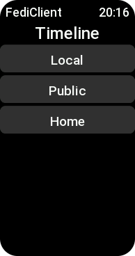
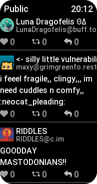
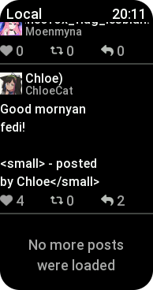
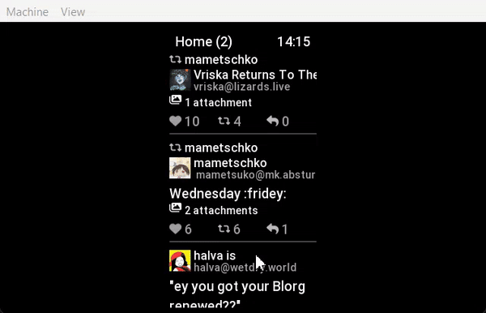

<h1 align="center">
  
   
  FediClient
</h1>
<h3 align="center">
  Open-source Mastodon client for Amazfit ZeppOS
</h3>

<b>Features:</b>
<ul>
  <li>Supports Mastodon API (/Sharkey) (Misskey support planned)</li>
  <li>Viewing timelines (Local/Public/Home)</li>
  <li>Viewing posts/post replies</li>
  <li>Profile pictures (dynamically generated tga; loaded asynchronously)</li>
  <li>Viewing post image attachments</li>
  <li>Viewing user profiles</li>
  <li>Posting (with a t-9 style keyboard)</li>
  <li>Authentication (optional, OAuth)</li>
  <li>Localization</li>
</ul>

<h2>Supported devices</h2>
<ul>
  <li>Amazfit Band 7 (Zepp OS 1.0)</li>
</ul>
(PRs welcome)

<!-- <h6>*Currently, only Amazfit Band 7 is officially supported, PRs welcome.</h6> -->
<h2>Screenshots</h2>

  <!--
-->&nbsp;&nbsp;<!--
--><!--
-->&nbsp;&nbsp;<!--
-->

 

(Screenshots may be out of date)

<h2>Install (on a real device)</h2>

Prerequisites:
<ul>
  <li>Make sure your device is supported (check the list above)</li>
  <li><a href="https://docs.zepp.com/docs/1.0/guides/tools/zepp-app/#developer-mode-opening-method">Activate the Developer Mode is in the Zepp app (click for guide)</a></li>
  <li>Install Node.js/npm</li>
  <li>Install <code>zeus</code> (<code>npm i @zeppos/zeus-cli -g</code>)</li>
</ul>

  Warning: Make sure <code>DEPLOYMENT_TYPE</code> is set to <code>"real"</code> in configuration.js

Build and install from source:
<ol>
  <!-- <li>
    (Optional) Some options can only be changed at compile-time, check/modify <code>configuration.js</code> as needed
  </li> -->
  <li>
    Run <code>zeus preview</code> in the project directory
    <ul>
      <li>
        If prompted, select your device from the list
      </li>
      <li>
        This should build the application, upload it and generate a temporary QR code
      </li>
    </ul>
  </li>
  <li>
    Open the Zepp App
  </li>
  <li>
    Go to "Profile" -> "My devices" -> (tap on your device) -> "Developer Mode"
  </li>
  <li>
    Switch to the "Mini Program" tab and tap the Plus (+) icon in the top-right corner
  </li>
  <li>
    Select the "Scan" option and scan the QR code generated by <code>zeus</code> (step 1)
    <ul>
      <li>If you're unable to scan the QR code using your camera, use the "Open G..." button (in the top-right corner, on the "Scan" screen) to select a screenshot of the code instead</li>
    </ul>
  </li>
</ol>

<!-- <h2>Usage</h2>

(Optional) Select instance/Authentication: -->

<h2>Localization</h2>

Supported languages:
<ul>
  <li>English (en-US)</li>
  <li>Ukrainian (uk-UA) (device-side only)</li>
</ul>
